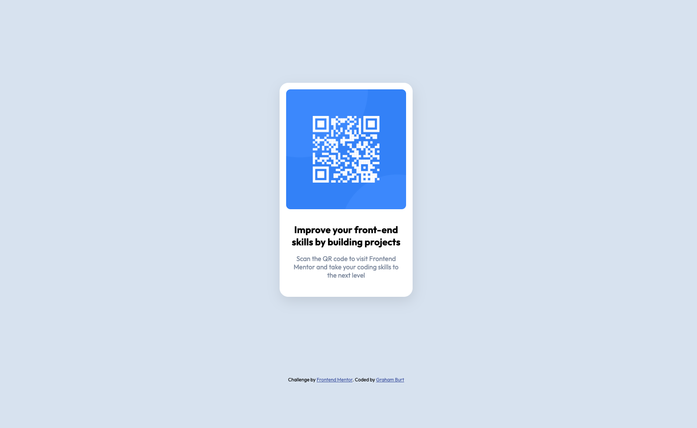

# Frontend Mentor - QR code component solution

This is a solution to the [QR code component challenge on Frontend Mentor](https://www.frontendmentor.io/challenges/qr-code-component-iux_sIO_H). Frontend Mentor challenges help you improve your coding skills by building realistic projects. 

## Table of contents

- [Overview](#overview)
  - [Screenshot](#screenshot)
  - [Links](#links)
- [My process](#my-process)
  - [Built with](#built-with)
  - [What I learned](#what-i-learned)
  - [Continued development](#continued-development)
  - [Useful resources](#useful-resources)
- [Author](#author)


## Overview

My first challenge on Frontend Mentor website, testing myself to match the design visual. I found it easy to create the elements but tricky to get the detail right, a very good initial introduction and I learned more about the whole process using Git, noting the detail via the Readme and how to consider the whole development process rather than just creating a website for myself.

### Screenshot




### Links

- Solution URL: [Solution-link](https://grahamburty.github.io/frontend-mentor-qr/)

## My process

### Built with

- Semantic HTML5 markup
- CSS custom properties
- CSS Grid


### What I learned

How to centre a div using css grid, very easy! 

```css
.first-row {
  place-self: center;
}
```

### Continued development

More css grid and flexbox. Powerful layout tools but tricky to master.


### Useful resources

- [css tricks](https://css-tricks.com/) - Always my go-to site for css questions. 


## Author

- Website - [grahamburt.net](https://grahamburt.net/)
- Frontend Mentor - [@grahamburty](https://www.frontendmentor.io/profile/grahamburty)
- Twitter - [@yourusername](https://www.twitter.com/burty_burty)

